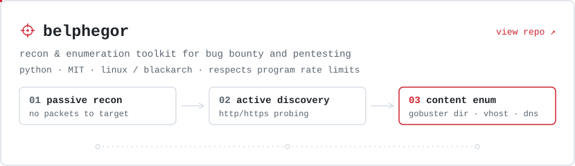
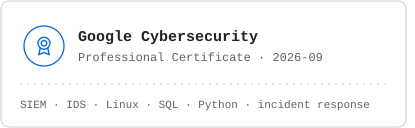
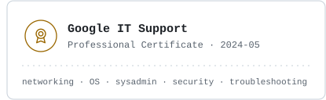

<picture>
  <source media="(prefers-color-scheme: dark)" srcset="assets/header-dark.svg">
  
</picture>

By day I work help desk at **Synapsis**: deploying Wazuh agents, building Zabbix dashboards, managing Active Directory, upgrading switch firmware and digging through FortiGate logs to find out why the VPN broke. I study infrastructure at **Universidad ORT**.

After hours I switch sides: Hack The Box, CTFs, and writing my own recon tooling on BlackArch.

Right now: working through Hack The Box machines and growing belphegor one phase at a time.

<a href="https://app.hackthebox.com/users/1083889"><picture><source media="(prefers-color-scheme: dark)" srcset="assets/link-hackthebox-dark.svg"></picture></a>&nbsp;
<a href="https://github.com/facundogomezuy/belphegor"><picture><source media="(prefers-color-scheme: dark)" srcset="assets/link-belphegor-dark.svg"></picture></a>

&nbsp;

<picture>
  <source media="(prefers-color-scheme: dark)" srcset="assets/log-dark.svg">
  
</picture>

&nbsp;

<a href="https://github.com/facundogomezuy/belphegor">
  <picture>
    <source media="(prefers-color-scheme: dark)" srcset="assets/belphegor-dark.svg">
    
  </picture>
</a>

&nbsp;

<picture>
  <source media="(prefers-color-scheme: dark)" srcset="assets/stack-dark.svg">
  
</picture>

&nbsp;

<!-- certificaciones: para que sean clickeables, envolvé cada <picture> con <a href="LINK_DE_CREDLY"> ... </a> -->
<picture><source media="(prefers-color-scheme: dark)" srcset="assets/cert-cybersecurity-dark.svg"></picture><picture><source media="(prefers-color-scheme: dark)" srcset="assets/cert-itsupport-dark.svg"></picture>
